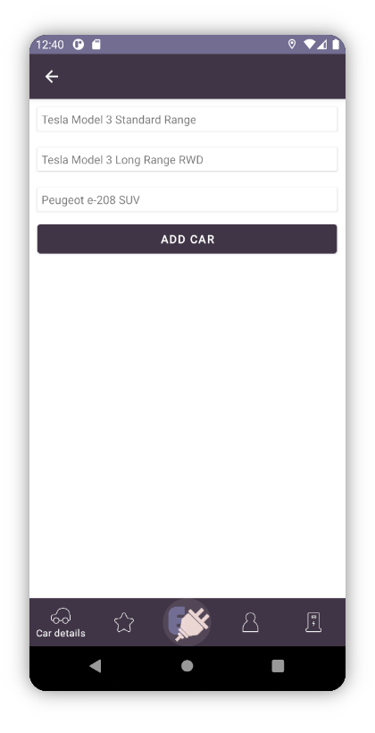
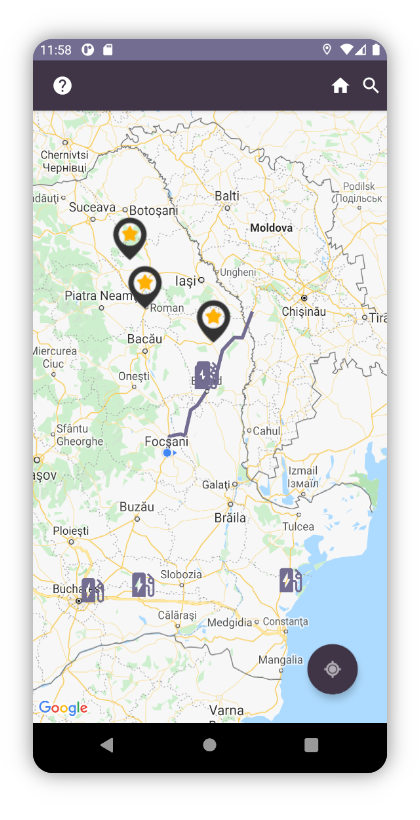
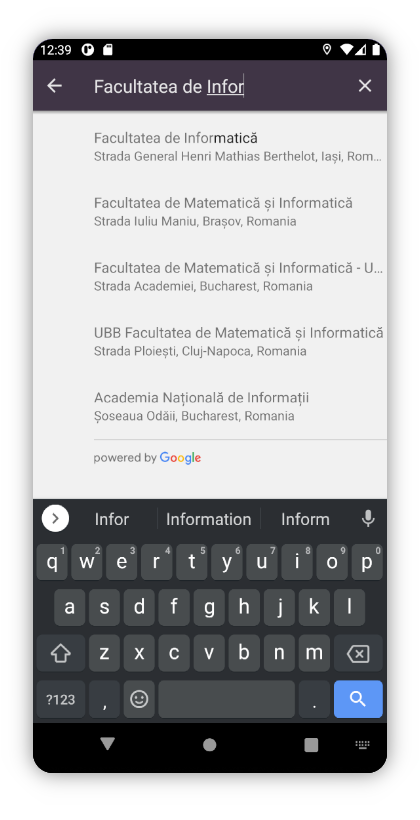
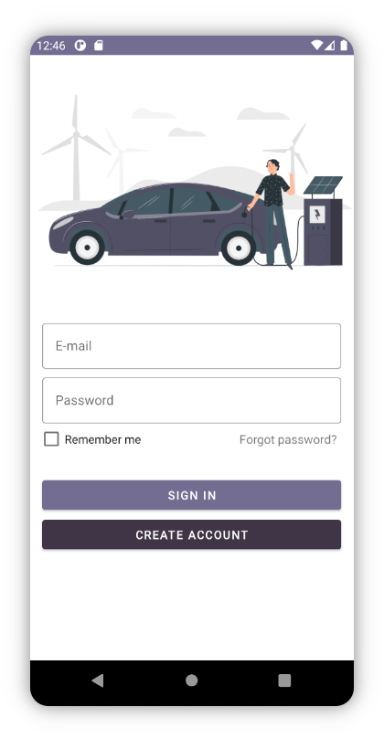
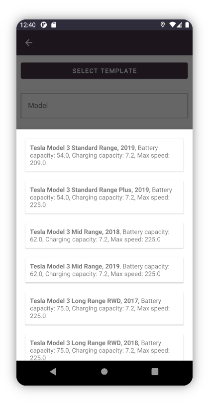

# Description

This project is a mobile interface for Android that allows users to plan a
route for their electric car based on the charging stations available along the
way. Other functionalities:

- adding your own stations
- reviewing stations
- adding stations to favourites
- paying through PayPal
- adding cars to your profile
- searching locations

# Screenshots

# Technologies

- Kotlin
- Android
- Google Maps
- Google Play Services
- Gradle
- OkHttp

# Copyright

Copyright © 2021, Coteanu Andra-Maria, Covali Dumitru, Lupu Teodor, Marele Carina-Ioana, Mihăeș Antonio, Pînzaru Robert-Cristian
